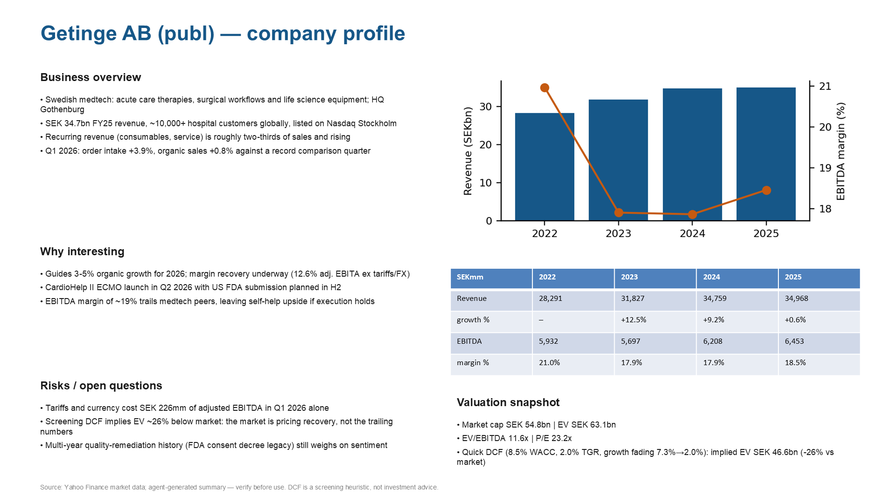

# analyst-agent

Give it a company name and it builds an investment one-pager.

Type `/company-profile Getinge` in [Claude Code](https://claude.com/claude-code) and the agent:

1. finds the ticker and pulls financials from Yahoo Finance
2. works out growth, margins and a quick screening DCF (`src/analysis.py`)
3. reads up on the company and writes a short thesis with sources
4. renders a one-slide PPTX (`src/render.py`)

The scripts handle everything with a number in it (fetching, maths, rendering), so the figures come out the same every run. The agent only does the parts that need judgement: finding the right ticker, the research, writing the thesis and checking the output. [`SKILL.md`](.claude/skills/company-profile/SKILL.md) describes how the two fit together.

## Example



The PPTX for Getinge AB (Swedish medtech, about SEK 34bn in revenue) is in [`examples/`](examples/).

## Running the scripts by hand

Each step works without the agent:

```bash
pip install -r requirements.txt
python src/fetch.py GETI-B.ST runs/geti/company.json
python src/analysis.py runs/geti/company.json runs/geti/analysis.json
# write runs/geti/thesis.json yourself (format in SKILL.md)
python src/render.py runs/geti/
```

## Limitations

- Yahoo Finance data isn't always clean. The fetch script tidies it up but doesn't check it.
- The DCF starts from the last year's free cash flow, fades growth down to 2% over five years and uses the same 8.5% WACC for every company. It's good for a first "cheap or expensive" read and not much more. One odd year, or lease-heavy companies under IFRS 16, can throw it off a lot.
- The thesis is only as good as the research behind it. Read it before you use it for anything.
